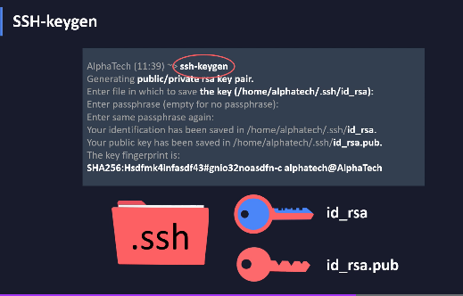

# Git and GitHub / Terminal

Source Study:
[FreeCodeCamp](https://youtu.be/RGOj5yH7evk)/
[FilipinoGuide-Terminal](https://youtu.be/bDxXRB66Xas)/[learngitbranching.js.org](https://learngitbranching.js.org/)/
[git-scm.com/](https://git-scm.com/)

## Bakit at paanu gumamit ng Terminal

<hr>

### Bakit gumagamit ng termnal

[1] <strong>Performance</strong>
-Terminal Process are faster <br>
yung program na ni rrun sa terminal madalas na mas mabilis yung execution kasi hindi nya na kailangan e render yung interface,yung GUI,di nya na kailangan ng extra space sa ram etc.
<br>

[2] <strong>Speed</strong>
-They're faster to execute<br>
madalas na mas mabilis yung operation sa terminal kaysa sa kung dadaan pa tayu sa
GUI kung anu pag e cclick natin stuff like that
<br>

[3] <strong>Scripting</strong> - automation is easy<br>
lahat ng nagagawa mo sa terminal is pwede mo silang e automate
<br>

[4] <strong>Composability</strong> - Programs can easily work together<br>
pwede ka mag chain ng commands and mas bibilis yung work flow mo

[5] <strong>Remote Access</strong> - You can do everything remotely <br>
access other machine (SSH (Secure Shell))

<br>

<br>
<code> $| </code> <strong>Prompt</strong> dollar sing and blinking cursor<br>
<code> ~ </code> <strong>working directory</strong> -short hand for home directory of user
<hr>
<br>

## <strong> command </strong><br>

> <code>"ls"</code> - list items <br>

```
user@Lance MINGW64 ~
$ ls
'3D Objects'/
 AppData/
'Application Data'@
 Contacts/
 Cookies@
 Desktop/
 Documents/
 Downloads/
 Favorites/
 Links/
'Local Settings'@

user@Lance MINGW64 ~

```

- mal llist yung mga item sa current directory ng user <br>
- pwede din tayu mag provide ng argument sa <code>ls</code>.<br>

sample

```
user@Lance MINGW64 ~
$ ls Pictures
 1.PNG           Capture.PNG               bg.PNG
 2.PNG           Feedback/                 bg2.png
 3.PNG           IMG_20201217_174231.jpg   bg3.PNG
 4.PNG          'LICENSE LANCE 2.jpg'      desktop.ini
 5.PNG          'LICENSE LANCE.jpg'        viber_image_2020-12-08_17-13-53.jpg
 6.PNG          'Saved Pictures'/
'Camera Roll'/  'a4 upload.jpg'

user@Lance MINGW64 ~
```

- ls pictures (argument) -will list all item inside the directory argument.

<strong>Flags</strong> - Flags are a way to set options and pass in arguments to the commands you run. Commands you run will change their behavior based on what flags are set.

-also sometimes modify the behavior

sample:

```
user@Lance MINGW64 ~
$ ls --help
Usage: ls [OPTION]... [FILE]...
List information about the FILEs (the current directory by default).
Sort entries alphabetically if none of -cftuvSUX nor --sort is specified.

Mandatory arguments to long options are mandatory for short options too.
  -a, --all                  do not ignore entries starting with .
  -A, --almost-all           do not list implied . and ..
      --author               with -l, print the author of each file
  -b, --escape               print C-style escapes for nongraphic characters
      --block-size=SIZE      with -l, scale sizes by SIZE when printing them;
                               e.g., '--block-size=M'; see SIZE format below
  -B, --ignore-backups       do not list implied entries ending with ~
  -c                         with -lt: sort by, and show, ctime (time of last
                               modification of file status information);
                               with -l: show ctime and sort by name;
                               otherwise: sort by ctime, newest first
  -C                         list entries by columns
      --color[=WHEN]         colorize the output; WHEN can be 'always' (default
                               if omitted), 'auto', or 'never'; more info below
  -d, --directory            list directories themselves, not their contents
  -D, --dired                generate output designed for Emacs' dired mode
  -f                         do not sort, enable -aU, disable -ls --color
  -F, --classify             append indicator (one of */=>@|) to entries
      --file-type            likewise, except do not append '*'
      --format=WORD          across -x, commas -m, horizontal -x, long -l,
                               single-column -1, verbose -l, vertical -C
      --full-time            like -l --time-style=full-iso
  -g                         like -l, but do not list owner
      --group-directories-first
                             group directories before files;
                               can be augmented with a --sort option, but any
                               use of --sort=none (-U) disables grouping
  -G, --no-group             in a long listing, don't print group names
  -h, --human-readable       with -l and -s, print sizes like 1K 234M 2G etc.
      --si                   likewise, but use powers of 1000 not 1024
  -H, --dereference-command-line
                             follow symbolic links listed on the command line
      --dereference-command-line-symlink-to-dir
                             follow each command line symbolic link
                               that points to a directory
      --hide=PATTERN         do not list implied entries matching shell PATTERN
                               (overridden by -a or -A)
      --hyperlink[=WHEN]     hyperlink file names; WHEN can be 'always'
                               (default if omitted), 'auto', or 'never'
      --indicator-style=WORD  append indicator with style WORD to entry names:
                               none (default), slash (-p),
                               file-type (--file-type), classify (-F)
  -i, --inode                print the index number of each file
  -I, --ignore=PATTERN       do not list implied entries matching shell PATTERN
  -k, --kibibytes            default to 1024-byte blocks for disk usage;
                               used only with -s and per directory totals
  -l                         use a long listing format
  -L, --dereference          when showing file information for a symbolic
                               link, show information for the file the link
                               references rather than for the link itself
  -m                         fill width with a comma separated list of entries
  -n, --numeric-uid-gid      like -l, but list numeric user and group IDs
  -N, --literal              print entry names without quoting
  -o                         like -l, but do not list group information
  -p, --indicator-style=slash
                             append / indicator to directories
  -q, --hide-control-chars   print ? instead of nongraphic characters
      --show-control-chars   show nongraphic characters as-is (the default,
                               unless program is 'ls' and output is a terminal)
  -Q, --quote-name           enclose entry names in double quotes
      --quoting-style=WORD   use quoting style WORD for entry names:
                               literal, locale, shell, shell-always,
                               shell-escape, shell-escape-always, c, escape
                               (overrides QUOTING_STYLE environment variable)
  -r, --reverse              reverse order while sorting
  -R, --recursive            list subdirectories recursively
  -s, --size                 print the allocated size of each file, in blocks
  -S                         sort by file size, largest first
      --sort=WORD            sort by WORD instead of name: none (-U), size (-S),
                               time (-t), version (-v), extension (-X)
      --time=WORD            change the default of using modification times;
                               access time (-u): atime, access, use;
                               change time (-c): ctime, status;
                               birth time: birth, creation;
                             with -l, WORD determines which time to show;
                             with --sort=time, sort by WORD (newest first)
      --time-style=TIME_STYLE  time/date format with -l; see TIME_STYLE below
  -t                         sort by time, newest first; see --time
  -T, --tabsize=COLS         assume tab stops at each COLS instead of 8
  -u                         with -lt: sort by, and show, access time;
                               with -l: show access time and sort by name;
                               otherwise: sort by access time, newest first
  -U                         do not sort; list entries in directory order
  -v                         natural sort of (version) numbers within text
  -w, --width=COLS           set output width to COLS.  0 means no limit
  -x                         list entries by lines instead of by columns
  -X                         sort alphabetically by entry extension
  -Z, --context              print any security context of each file
  -1                         list one file per line.  Avoid '\n' with -q or -b
      --append-exe           append .exe if cygwin magic was needed
      --help     display this help and exit
      --version  output version information and exit

The SIZE argument is an integer and optional unit (example: 10K is 10*1024).
Units are K,M,G,T,P,E,Z,Y (powers of 1024) or KB,MB,... (powers of 1000).
Binary prefixes can be used, too: KiB=K, MiB=M, and so on.

The TIME_STYLE argument can be full-iso, long-iso, iso, locale, or +FORMAT.
FORMAT is interpreted like in date(1).  If FORMAT is FORMAT1<newline>FORMAT2,
then FORMAT1 applies to non-recent files and FORMAT2 to recent files.
TIME_STYLE prefixed with 'posix-' takes effect only outside the POSIX locale.
Also the TIME_STYLE environment variable sets the default style to use.

Using color to distinguish file types is disabled both by default and
with --color=never.  With --color=auto, ls emits color codes only when
standard output is connected to a terminal.  The LS_COLORS environment
variable can change the settings.  Use the dircolors command to set it.

Exit status:
 0  if OK,
 1  if minor problems (e.g., cannot access subdirectory),
 2  if serious trouble (e.g., cannot access command-line argument).

GNU coreutils online help: <https://www.gnu.org/software/coreutils/>
Report any translation bugs to <https://translationproject.org/team/>
Full documentation <https://www.gnu.org/software/coreutils/ls>
or available locally via: info '(coreutils) ls invocation'

user@Lance MINGW64 ~


```

<hr>

> Up/Down - Browse command history <br>
> Tab - trigger autocomplete <br>
> pwd - present working directory <br>
> cd - change directory <br>
> cd .. - move up a folder
> && - run after first command

## Anu nga ba ang Git?

- most commonly used version control system
- <b>Version control</b> also known as source control is the practice of tracking and mananging changes to software code.
- Git tracks the changes you make to files, so you have a record of what has been done.
  -Free and open source version control system
- most widely used version control system in development.
- most programmers interact with git on a daily basis.

## Why do we need Git

- like for example is my project tayo or code na umaabut ng thousand lines
  or malaki na sya.ang tendency is gumagawa tayo ng back up natin or nag vversion tayo ng file.kasi kung nagkamali tayo.patay kasi contaminated yung buong project natin.medyu mahirap hanapin kung anu talaga ang error tapus magkaka gulo gulo na.so gusto natin parang may fall back plan tayo,may plan B tayo.<br>
- what we do usually if sa folder file is nag cocopy paste tayo ng folder at nilalagyan natin ng version number(versioning)
  <strong>this comes with a lot of problems </strong>.I'll name a few:<br>

Problems with this method

- [1] takes up too much space
- [2] can't track smaller changes
- [3] Hard to code with others or collaboration

to solve those problems we have <strong>Source Control Management (SCM)</strong><br>

- most used (SCM) is <strong>git</strong>
- instead of storing a copy of the whole,Git tracks the changes per file.
- consequently, it makes collaborative coding smoother

## What is Version Control

the management of changes to documents, computer programs,large websites, and other collections of information.

## Version Control

- Keep Versions of every file/directory
- Documents changes with descriptive message
- Displaying differences

## install git

[https://git-scm.com/downloads](https://git-scm.com/downloads)

git version

```
user@Lance MINGW64 ~/Desktop/git-github_study (master)
$ ^C

user@Lance MINGW64 ~/Desktop/git-github_study (master)
```

git commands:

```
user@Lance MINGW64 ~/Desktop/git-github_study (master)
$ git
usage: git [--version] [--help] [-C <path>] [-c <name>=<value>]
           [--exec-path[=<path>]] [--html-path] [--man-path] [--info-path]
           [-p | --paginate | -P | --no-pager] [--no-replace-objects] [--bare]
           [--git-dir=<path>] [--work-tree=<path>] [--namespace=<name>]
           <command> [<args>]

These are common Git commands used in various situations:

start a working area (see also: git help tutorial)
   clone             Clone a repository into a new directory
   init              Create an empty Git repository or reinitialize an existing one

work on the current change (see also: git help everyday)
   add               Add file contents to the index
   mv                Move or rename a file, a directory, or a symlink
   restore           Restore working tree files
   rm                Remove files from the working tree and from the index
   sparse-checkout   Initialize and modify the sparse-checkout

examine the history and state (see also: git help revisions)
   bisect            Use binary search to find the commit that introduced a bug
   diff              Show changes between commits, commit and working tree, etc
   grep              Print lines matching a pattern
   log               Show commit logs
   show              Show various types of objects
   status            Show the working tree status

grow, mark and tweak your common history
   branch            List, create, or delete branches
   commit            Record changes to the repository
   merge             Join two or more development histories together
   rebase            Reapply commits on top of another base tip
   reset             Reset current HEAD to the specified state
   switch            Switch branches
   tag               Create, list, delete or verify a tag object signed with GPG

collaborate (see also: git help workflows)
   fetch             Download objects and refs from another repository
   pull              Fetch from and integrate with another repository or a local branch
   push              Update remote refs along with associated objects

'git help -a' and 'git help -g' list available subcommands and some
concept guides. See 'git help <command>' or 'git help <concept>'
to read about a specific subcommand or concept.
See 'git help git' for an overview of the system.

user@Lance MINGW64 ~/Desktop/git-github_study (master)

```

## Terms

- <em>Directory</em> - Folder
- <em>Terminal or Command Line</em> - Interface for Text Commands
- <em>C-L-I</em> - Command Line Interface
- <em>CD</em> - Change Directory
- <em>Code Editor</em> - Word Processor for Writing Code
- <em>Repository</em> - Project, or the folder/place where your project is kept
- <em>Git</em> - the tool that tracks the changes in your code over time
- <em>Github</em> - A website to host your repositories online

## Git Commands

- <em> clone </em> - Bring a repository that is hosted somewhere like Github into a folder on your local machine.
- <em> add </em> - track your files and changes in Git
- <em> commit </em> - Save your files in Git
- - A commit is a "snapshot of the project.
- <em> push </em> - Upload Git commits to a remote repo, like Github
- <em> pull </em> - Download changes from remote repo to your local machine, the opposite of push

## other terms

- <em>staging<em>A staging step in git allows you to continue making changes to the working directory, and when you decide you wanna interact with version control, it allows you to record changes in small commits.<br>
- <em>Unstaged changes</em> are changes that are not tracked by the Git. For example, if you copy a file or modify the file. Git maintains a staging area(also known as index) to track changes that go in your next commit. ... The next git commit will transfer all items from staging into your repository.

> git config --list

- show all your git settings

```
user@Lance MINGW64 ~/Desktop/git-github_study (master)
$ git config --list
diff.astextplain.textconv=astextplain
filter.lfs.clean=git-lfs clean -- %f
filter.lfs.smudge=git-lfs smudge -- %f
filter.lfs.process=git-lfs filter-process
filter.lfs.required=true
http.sslbackend=openssl
http.sslcainfo=C:/Program Files/Git/mingw64/ssl/certs/ca-bundle.crt
core.autocrlf=true
core.fscache=true
core.symlinks=false
pull.rebase=false
credential.helper=manager-core
credential.https://dev.azure.com.usehttppath=true
user.name=Lance Valle
user.email=vallelance8@gmail.com
core.repositoryformatversion=0
core.filemode=false
core.bare=false
core.logallrefupdates=true
core.symlinks=false
core.ignorecase=true
remote.origin.url=git@github.com:lance28-beep/git-github_study.git
remote.origin.fetch=+refs/heads/*:refs/remotes/origin/*
branch.master.remote=origin
branch.master.merge=refs/heads/master

user@Lance MINGW64 ~/Desktop/git-github_study (master)

```

configure your user name and user email

```
user@Lance MINGW64 ~/Desktop/git-github_study (master)
$git config --global user.name "Rolando Valle"
user@Lance MINGW64 ~/Desktop/git-github_study (master)
$git config --global user.email "yourEmailHere"

```

-when you are in a team.this will help your team to recognize who did the changes in repo.<br>
-every change that you're going to make in your projects should be documented with your details

## What is github

ang github is nag sserve sya as para bang google drive ng mga git repository.<br>
coders can collaborate on code in github easier.<br>

# Create Account

[github.com](https://github.com/)

> create <em>New repository</em><br>
> input <em>Repository name</em><br> > <em>Create repository</em>

...or create a new repository on the command line

```
echo "# bfhdfhdf" >> README.md
git init
git add README.md
git commit -m "first commit"
git branch -M main
git remote add origin https://github.com/lance28-beep/bfhdfhdf.git
git push -u origin main
```

...or push an existing repository from the command line

```
git remote add origin https://github.com/lance28-beep/bfhdfhdf.git
git branch -M main
git push -u origin main
```

## Notes

<hr>
<em>ls -la</em> -means ( list everything in the directory,including hidden files and folders )
<hr>

```
git status
```

shows me all the of the files that were updated or created or deleted,but haven't been saved in a commit yet.

<hr>

```
git add .
```

track your files and changes in Git. <br>
. (dot) - all files

<hr>

```
git commit -m "added index.html"
```

(-m) dash m is for message <br>
you need to have a message in order to commit your files. <br>
this will only save the code locally or commit isn't live on Github yet.<br>
<strong>Best practice:!</strong> : Use <b>imperative form</b> for commit messages (nag uutos)

<hr>

```
git push
```

we want to push our code live to a remote repository where our project is hosted

<hr>

<code>git log --oneline</code>

```
PS C:\Users\user\Desktop\Git and Github\git-github_study> git log --oneline
8b374bb (HEAD -> about-terminal, master) added there
a096a3d add html
d238587 Merge pull request #1 from lance28-beep/feature-readme-instructions
3b8b13e (origin/feature-readme-instructions) update my notes
3b3c58a add notes
8456379 updated readme
ae4c1b1 update notes
3802218 update
c0a2388 Merge branch 'master' of https://github.com/lance28-beep/git-github_study
b39215a rename readme file
b7d8f7c Delete README.md
2574b70 Create README.md
b5251ee documentation update
4765de5 adding mynotes and index.html
```

## What is Git Tags

- tagging in git or any other vcs refers to creating specific points in history for your repository/data.

- this is usually done to mark release points.

## Why should I create Tags

- to mark release points for your code/dat
- to create historic restore points

## When to create Tags

- When you want to create a release point for a stable version of your code
- When you want to create a historic point for your code/data that you can refer at any future time(to restore your data)

## How to create Tags

[1] Checkout the branch where you want to create the tag

> git checkout \<branch name>

[2] Create tag with some name<br>

> git tag \<tagname>

<b>two types of creating tag</b><br>

- Lightweight tag

```
git tag v1.0
```

- annotated

```
git tag -a v1.1 -m "my version 1"
```

in annotated tag you can give some message and it also contain all the information about the tagger and it will be stored as a complete git object in git Repositoru

## SSH Keys

in order to push them to Github under your account,you're going to have to prove to github that you are the owner or your account.<br>
so you have to connect your local machine to your github account somehow.
<br>
The way this is done is by using SSH keys.

```
ssh-keygen -t rsa -b 4096 -C "email.example.com"
```

```
PS C:\Users\user\Desktop\Git and Github\git-github_study> ssh-keygen -t rsa -b 4096  -C "myEmail@gmail.com"
Generating public/private rsa key pair.
Enter file in which to save the key (/c/Users/user/.ssh/id_rsa): testkey
Enter passphrase (empty for no passphrase):
Enter same passphrase again:
Your identification has been saved in testkey
Your public key has been saved in testkey.pub
The key fingerprint is:
SHA256:tG1HLoTHufmvbZOP7qSfTjBX3kd30+2mf5K1Csw7HIU myEmail@gmail.com@gmail.com
The key's randomart image is:
+---[RSA 4096]----+
|                 |
|         o .    o|
|        o = o  .B|
|       . = E . ==|
|        S * * . *|
|         .o= + oo|
|          .+o ++.|
|           oo**=.|
|           .+O@++|
+----[SHA256]-----+
PS C:\Users\user\Desktop\Git and Github\git-github_study>
```

search for the key that was generated

```
PS C:\Users\user\Desktop\Git and Github\git-github_study> ls | grep testkey
-a----         7/19/2021   6:47 PM           3389 testkey
-a----         7/19/2021   6:47 PM            747 testkey.pub
PS C:\Users\user\Desktop\Git and Github\git-github_study>
```

There are two test key that was generated<br>

- testkey - private key,and it is the one that you have to keep secure on your local machine
- testkey.pub - the key that you're going to upload to your github interface.<br>
- pub stands for public,its called your public key,which means that its okay for other people to see this key.

How it works is that the public key you put on Github,and everytime you want to connect to GitHub or push your code on GitHub or use your account via you local machine, you use your private key to show Github,that you are the one that generated this public key.Its a mathematical proof that only this private key could have generated this public key.

### print out public key

```
cat testkey.pub
```

<hr>

```
git push origin master
```

<em>origin</em> - is an option set for here.

- basically a word that stands for the location of our Git repository <br>

<em>master</em> - is the branch that we want to push to.

<hr>

## Starting Repo locally

- create a folder locally
  > git init <br>
- - initialize Git repository
- - <code>.git</code> pop up file .git(dito naka store ni git ang files nya to help with yung versioning natin)
- - (git process e.i git add ./git commit/git status)
- to push(create a new Git repository)
- - Repository name
- - description
- - create repository
- copy ssh from newly created repository <br>

sample:

> git remote add origin git@github.com:lance28-beep/git-github_study.git

- <em>remote<em> means somewhere else,but not on this computer
- we are going to use this to add a reference to the remote repository on Github
  > git remote -v
- it shows any remote repositories that we connected to this repo.
- now that this are set up.we can now use git push origin.

## GitHub Workflow

<hr>

- Write code
- Commit Changes

> notice that there wasn't an step here <br>(no git add to stage changes) - because gitHub handles that for us<br>
> by committing in github, we are adding and commiting at the same time.

- make a pull request

## Local Git WorkFlow <hr>

- write code
- stage changes <code>git add</code>
- commit changes <code>git commit</code>
- push changes <code>git push</code>

  > this will update github source code or the code in the github repository with the changes that we made locally.

  <hr>

  ## Local Changes

> git status <br>

displays the state of the working directory and the staging area. It lets you see which changes have been staged, which haven't, and which files aren't being tracked by Git. Status output does not show you any information regarding the committed project history.

> git diff

git diff is a multi-use Git command that when executed runs a diff function on Git data sources.
<br>changes to tracked files

> git add .

Add all current changes to the next commit

> git add -p \<file>

Add some changes in file to the next commit

> git commit -a

Commit all local changes in tracked files

> git commit

Commit previously stagged changes

> git commit --amend

change the last commit
(note-dont amend published commits)

# Git Branching

<strong>Git branches</strong> - are effectively a pointer to a snapshot of your changes. ... The implementation behind Git branches is much more lightweight than other version control system models. Instead of copying files from directory to directory, Git stores a branch as a reference to a commit. <br>


<hr>
Git Branching <br>
<strong>Master Branch</strong>
-naming convention for the main or the default branch in a repository
<br>its called branching becuasse it starts to look more like a tree when you have mulitple branches.

- Commit # 1
- Commit # 2
- Commit # 3

<strong>Feature branch</strong>
A feature branch is a copy of the main codebase where an individual or team of software developers can work on a new feature until it is complete. With many engineers working in the same code-base, it's important to have a strategy for how individuals work together.


<strong>Hotfix Branches</strong>
Maintenance or “hotfix” branches are used to quickly patch production releases. Hotfix branches are a lot like release branches and feature branches except they're based on main instead of develop . This is the only branch that should fork directly off of main

> git branch - list all existing branches <br>
> git checkout \<branch\> <br>
> git checkout -b feature-readme-instructions
> git switch -b feature-readme-instructions

```
user@Lance MINGW64 ~/Desktop/Git and Github/git-github_study (master)
$ git switch feature-readme-instructions
Switched to branch 'feature-readme-instructions'
M       README.md

user@Lance MINGW64 ~/Desktop/Git and Github/git-github_study (feature-readme-instructions)
$ git add .

user@Lance MINGW64 ~/Desktop/Git and Github/git-github_study (feature-readme-instructions)
$ git status
On branch feature-readme-instructions
Changes to be committed:
  (use "git restore --staged <file>..." to unstage)
        modified:   README.md


user@Lance MINGW64 ~/Desktop/Git and Github/git-github_study (feature-readme-instructions)
$
```

## Branches & Tags

> git branch -av <br>

List all existing branches

> git checkout \<name_of_branch>

Switch Head branch

> git branch \<new_branch> or git checkout -b \<new_branch>

Create a new branch based on your current Head

> git checkout --track <remote/branch>

Create a new tracking branch based on a remote branch

> git branch -d \<name_of_branch>

Delete a local branch

> git tag \<tag-name>

Mark the current commit with a tag

## What is a <strong>pull request</strong> or PR <hr>

basically a request to have your code pulled into another branch.
A pull request is a method of submitting contributions to an open development project. ... A pull request occurs when a developer asks for changes committed to an external repository to be considered for inclusion in a project's main repository.

<hr>

### notes

generally the workflow has been <code>git add</code> and then file name or period dot everything in this directory.this time,there's a shortcut,<underline>because we've just modified one file.and the file has already been committed to git in the past,which is why it says modified and not created.

> git commit -am <br>

<code>-am</code> - dash a stands for add and m at the same time for message

> git merge master

remember how i sadi before that merging locally wasnt the regular pattern.while it isn't for merging branches into master.but master gets updated as you go along as you're working on your project,because maybe other people are merging into master and you don't have those changes in your branch.But you dont want to get too far behind the master as you're working because then its going to be really difficult to merge later.so as changes are made to master in the GitHub repo,you're going to want to pull those down to your local master branch.

<hr>

## Undoing in Git

Undo Commit (After git commit, Before git push)
If you have committed changes to a file (i.e. you have run both git add and git commit ), and want to undo those changes, then you can use <strong>git reset HEAD~</strong> to undo your commit.

<i>So what if we make a mistake?what if we accidentally add something or commit something to git,and we didn't mean to do it,we can actully undo our stages or our commits</i>

> git reset

we can either do git reset with no arguments,or I can say git reset and just the name of the file that we want to onstage.

```
$ git reset
Unstaged changes after reset:
M       README.md
M       index.html
```

> git reset HEAD~1

what head means to GIT is a pointer to the last commit.<br>
so I'm telling it to do something with the last commit<br>
<code>~1</code> which is telling git instead of pointing to this last commit that I just made,right here,I want you to go back one commit further,and head will now point back one commit further meaning it will completely undo the commit that we just made
-unstaged and uncommitted those last changes

<hr>

## Forking in git

A fork is a copy of a repository. Forking a repository allows you to freely experiment with changes without affecting the original project.


its going to make a complete copy of the repository.<br>
<strong>Why would you want to Fork?</strong>
we probably don't want to fork our own repo because we already have full access to all of the code.<br>
but for other people's repos.

## <code>from Udemy notes:</code>

## unstaging a staged file in git

un-stage or how to take it from the stagina area.

> git restore --staged \<file>
> git reset HEAD \<file>

## unmodifying files - revert last commit operation in git

revert a modified file

> git restore \<file>

# GitHub:First Steps & Basics

## Why we need Remote Version Control?

- Version Control
- Collaboration

## Collaboration & Online Backup -Importance

- Collaboration Importance<br>
  
  <br>
  -and copy of your project online and not only in your computer

## Choosing GitHub RVCS <br>

<br>
<code>GitHub</code><br>

- Microsoft acquired GitHub for $7.5 Billion Dollars
- Considered to be the largest Community of Developers in the world.
  - Users: Over 40 Million!
  - Repositories: Over 100 Million!
    <code>
    " It's a Git Repositories Hosting Service that has <u>code collaboration </u> and <u>version control</u> tools for Repositories Management"
    </code>

# GitHub:Commands & Functionalities

## Trying to push local to remote

> git init
> git remote add origin \<SSH repo>
> git remote -v

## SSH

- Secure Shell<br>
  
  
  <br>

## Raw Blame History

- raw
  - used to copy code<br>
- blame
  - used to view the author of the code<br>
- History
  - view code history of commits in a given file<br>
    <br>

## github issues & labels<br>

<br>

- GitHub Issues is a tracking tool that is integrated with your GitHub repository. Use GitHub Issues to focus on important tasks and keep plans up to date simultaneously. Every agile team needs to organize its work, but no one wants to stop working in order to track work

- github todo list

### labels

<br>

## .gitignore

> create a file name <code>.gitignore</code>
> build/
> \*.txt //all files with .txt wont be part of commit or push

## Introduction

- Strengthen code git concepts
- Visualizing Material
  <br>

## Untrated State

<br>
-untracked by git or this wil be not yet documented by git<br>
<br>

## Tracking New Files

<br>

> git add \<file>

<br>

## Staging Modified Files

<br>
<br>

## Two States After Staged

<br>
<br>

## Branching : Full Introduction to Merging

> git checkout -b feature

- creating branch

> git checkout feature

- checkout branch

## git status short

> git status --short


<br>


## git log --> going further
> git log 